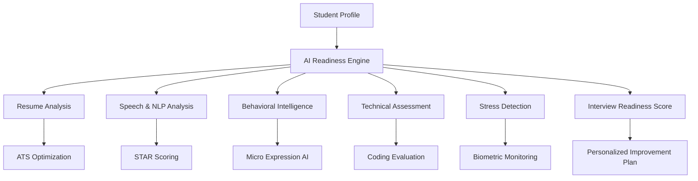

# InterviewIQ-The-Future-of-Interview-Readiness
AI-powered interview readiness platform that evaluates a student’s technical skills, communication, confidence, portfolio strength, emotional resilience, and recruiter compatibility — then generates a personalized roadmap to land their dream job.

# 🚀 Interview Readiness AI Platform

  
  
  
  

  <b>Transforming Interview Preparation from Guesswork into Data-Driven Confidence</b>

---

# 🌟 Problem Statement

Every year, millions of students graduate and enter the competitive job market. Despite having strong academic backgrounds, many struggle to determine whether they are truly interview-ready.

Most candidates discover critical weaknesses only after facing real recruiters — when opportunities have already been lost.

This project aims to solve that challenge by creating an intelligent AI-powered system that:

✅ Evaluates interview readiness objectively
✅ Detects technical, communication, and behavioral gaps
✅ Simulates real interview pressure
✅ Generates personalized improvement plans
✅ Provides measurable confidence through a Readiness Score

---

# 🎯 Vision

> “Turn interviews from a test of luck into a test of data.”

When a student sees an **Interview Readiness Score of 85%**, they don’t just feel confident — they have the evidence to prove it.

---

# 🧠 Project Overview

The Interview Readiness AI Platform is an advanced AI-driven ecosystem designed for:

* 🎓 Students
* 💼 Job Seekers
* 🏢 Universities
* 🚀 Placement Cells
* 👨‍💻 Bootcamps
* 📚 EdTech Platforms

The system combines:

* AI Mock Interviews
* NLP-based Speech Analysis
* Resume Intelligence
* Emotion & Stress Detection
* Technical Assessment Engines
* Real-Time Feedback Systems
* AI Mentorship Matching

into one unified platform.

---

# ⚡ Key Features

# 🧠 Cognitive & Psychological Intelligence

## 1️⃣ Biometric Stress Analysis

### Features

* Heart rate variability tracking
* Wearable integration (Apple Watch/Fitbit)
* Topic-specific stress detection
* Fight-or-flight response analysis

### Purpose

Identify which interview questions trigger stress or anxiety.

---

## 2️⃣ The “Curveball” AI Interviewer

### Features

* Dynamic interviewer personality shifts
* Friendly → Skeptical → Stoic transitions
* Emotional resilience testing
* Pressure adaptation analysis

### Goal

Prepare students for unpredictable real-world interviewers.

---

## 3️⃣ Imposter Syndrome Meter

### Features

* Self-assessment comparison
* Confidence vs performance analytics
* Psychological readiness scoring

### Outcome

Highlights the gap between perceived and actual ability.

---

## 4️⃣ Micro-Expression Feedback Engine

### AI Vision Analysis

* Eye contact tracking
* Blink rate analysis
* Facial confidence detection
* Lip tension recognition
* Nervous behavior identification

### Benefits

✔ Improved confidence
✔ Better recruiter impression
✔ Enhanced communication presence

---

# 📊 Objective Assessment Engines

## 5️⃣ AI “Fluff” Detector

### NLP Features

* Detects filler words
* Removes buzzword-heavy language
* Encourages measurable achievements
* Improves storytelling clarity

### Example

❌ “I worked on many projects.”
✅ “Developed 3 scalable ML pipelines improving efficiency by 42%.”

---

## 6️⃣ STAR Method Scoring Engine

### AI Evaluation

The system automatically scores answers based on:

| STAR Component | Evaluation                |
| -------------- | ------------------------- |
| Situation      | Context clarity           |
| Task           | Responsibility definition |
| Action         | Technical contribution    |
| Result         | Quantifiable outcome      |

---

## 7️⃣ Knowledge Heatmap Dashboard

### Visual Analytics

Tracks performance across:

* Technical Skills
* Leadership
* Communication
* Cultural Fit
* Problem Solving
* Behavioral Readiness

### Output

Interactive heatmaps showing strengths and weaknesses.

---

## 8️⃣ Pause Intelligence Analyzer

### Smart Analysis

* Thoughtful pause detection
* Struggle pause identification
* Speech pacing analysis
* Cognitive flow measurement

---

# 🛠️ Simulation & Immersive Environment

## 9️⃣ VR Office Simulations

### Environments

* Corporate boardrooms
* Startup offices
* Noisy cafes
* Panel interview rooms
* HR cabins

### Objective

Desensitize students to pressure-heavy environments.

---

## 🔟 The “Shadow” Interviewer

### Features

* Side-by-side candidate comparison
* “Perfect answer” playback system
* Self-improvement benchmarking

### Learning Impact

Students instantly understand how elite candidates respond.

---

## 1️⃣1️⃣ Collaborative Mock Battles

### Multiplayer Features

* Student vs Student interviews
* AI referee scoring
* Real-time comparative feedback
* Leaderboards & rankings

---

## 1️⃣2️⃣ Elevator Pitch Gauntlet

### Challenge Mode

Students must explain:

* Technical concepts
* Projects
* Startup ideas
* Research work

within 30 seconds to:

* Non-technical HR
* CEOs
* Recruiters
* Investors

---

# 🚀 Advanced AI & Integrations

## 1️⃣3️⃣ Dynamic Job Description Scraper

### Features

* Job URL parsing
* Company-specific mock generation
* Culture-fit question generation
* Tech-stack-based assessments

### Supported Platforms

* LinkedIn
* Indeed
* Glassdoor
* Company Career Pages

---

## 1️⃣4️⃣ Reverse Interview Intelligence

### AI Evaluation

The platform scores:

* Strategic questioning ability
* Curiosity level
* Leadership mindset
* Business awareness

### Example

> “How does your engineering team balance rapid delivery with technical debt?”

---

## 1️⃣5️⃣ Real-Time “Wobble” Alerts

### Smart Monitoring

Detects when students:

* Talk too fast
* Drift off-topic
* Use excessive fillers
* Lose structure

### Response

Subtle visual indicators help students self-correct instantly.

---

## 1️⃣6️⃣ Resume-to-Voice Consistency AI

### Verification Engine

The AI checks:

* Resume claims
* Verbal explanations
* Technical consistency
* Timeline accuracy

### Red Flag Detection

Flags contradictions recruiters may notice.

---

# 📈 Long-Term Growth & Community Ecosystem

## 1️⃣7️⃣ Readiness Score Passport

### Features

* Verified readiness score
* Recruiter-shareable profile
* Interview credibility badge
* Skill-based ranking

### Vision

A “credit score” for interview preparedness.

---

## 1️⃣8️⃣ Crowdsourced Real-Talk Questions

### Community Intelligence

Pulls:

* Latest interview experiences
* Real recruiter questions
* Company-specific patterns
* Emerging industry trends

### Platforms Integrated

* Glassdoor
* Reddit
* LinkedIn Communities

---

## 1️⃣9️⃣ Blind Technical Challenge Engine

### AI Assessment

Tracks:

* Coding speed
* Logic explanation ability
* Cognitive load balance
* Communication during coding

### Focus

Measures real engineering interview performance.

---

## 2️⃣0️⃣ AI Mentor Matching System

### Smart Matching

Connects students with:

* Alumni
* Industry mentors
* Recruiters
* Senior engineers

based on:

* Weakness areas
* Career goals
* Skill gaps
* Interview history

---

# 🏗️ System Architecture

---

# 🧩 Core Modules

| Module                | Function                           |
| --------------------- | ---------------------------------- |
| Resume Intelligence   | ATS & consistency analysis         |
| AI Mock Interviewer   | Simulated recruiter interaction    |
| Speech Analyzer       | Communication & fluency evaluation |
| Technical Engine      | Coding & technical readiness       |
| Emotion AI            | Stress & confidence analysis       |
| Recommendation Engine | Personalized learning paths        |
| Mentor Matching       | Connects students to experts       |

---

# ⚙️ Technology Stack

| Category        | Technologies                    |
| --------------- | ------------------------------- |
| Frontend        | React.js, Next.js, Tailwind CSS |
| Backend         | Node.js, FastAPI, Python        |
| AI/NLP          | OpenAI, LangChain, HuggingFace  |
| Computer Vision | OpenCV, MediaPipe               |
| Speech Analysis | Whisper API, NLP Pipelines      |
| Database        | PostgreSQL, MongoDB             |
| Authentication  | Firebase/Auth0/JWT              |
| Cloud           | AWS / Azure / GCP               |
| DevOps          | Docker, Kubernetes              |
| Analytics       | Grafana, Prometheus             |

---

# 📊 Readiness Scoring System

The platform generates a unified:

# 🎯 Interview Readiness Score

based on:

| Factor                | Weightage |
| --------------------- | --------- |
| Technical Skills      | 30%       |
| Communication         | 20%       |
| Resume Quality        | 15%       |
| Behavioral Confidence | 15%       |
| Problem Solving       | 10%       |
| Cultural Fit          | 10%       |

---

# 📈 Personalized Improvement Plans

Each student receives:

✅ Weakness Analysis
✅ Topic-wise Recommendations
✅ Mock Interview Suggestions
✅ Communication Improvement Tasks
✅ Resume Enhancement Guidance
✅ Mentor Recommendations

---

# 🔥 Innovation Highlights

| Innovation                      | Impact                          |
| ------------------------------- | ------------------------------- |
| AI Emotion Detection            | Measures confidence objectively |
| Resume-to-Voice Validation      | Detects inconsistencies         |
| VR Interview Simulation         | Reduces real-world anxiety      |
| Dynamic Interview Personalities | Builds resilience               |
| Real-Time Feedback System       | Instant self-correction         |
| AI Mentor Matching              | Accelerates improvement         |

---

# 📚 Research Contribution

This project contributes toward:

* AI-Powered Career Readiness
* Behavioral Intelligence Systems
* AI-Based Recruitment Simulation
* Interview Analytics
* Emotional AI Applications
* Human-AI Interaction
* Educational Technology Innovation

---

# 🎯 Target Users

## 👨‍🎓 Students

* Placement preparation
* Internship readiness
* Campus recruitment

## 🏫 Universities

* Placement cell analytics
* Student readiness tracking
* Mock interview infrastructure

## 🚀 EdTech Platforms

* AI coaching systems
* Interview preparation modules
* Personalized learning systems

## 🏢 Recruiters

* Pre-screening insights
* Verified readiness scores
* Better candidate matching

---

# 📈 Expected Outcomes

## Students

* Increased interview confidence
* Better placement success rate
* Improved communication
* Reduced interview anxiety

## Recruiters

* Better candidate filtering
* Reduced hiring uncertainty
* Faster screening process

## Universities

* Higher placement statistics
* Data-driven student training
* Improved recruiter trust

---

# 🌍 Future Scope

* AI avatar recruiters
* Full VR interview ecosystems
* Blockchain-verified readiness passports
* Real-time recruiter dashboards
* Multilingual interview support
* AI-generated career roadmaps
* Personalized learning agents
* Neuroadaptive interview training

---

# 👨‍💻 Ideal Roles & Relevance

This project showcases expertise for:

* AI Engineer
* Solution Architect
* Machine Learning Engineer
* NLP Engineer
* Computer Vision Engineer
* Full Stack Developer
* Product Engineer
* EdTech Innovator
* Human-AI Interaction Researcher

---

# 🚀 Why This Project Stands Out

✨ Recruiter-focused innovation
✨ Real-world problem solving
✨ Advanced AI integration
✨ Behavioral + technical intelligence
✨ End-to-end interview ecosystem
✨ Strong research & product vision
✨ Future-ready EdTech platform

---

# 📬 Collaboration & Contributions

We welcome:

* AI Researchers
* Open Source Contributors
* EdTech Innovators
* Career Coaches
* Recruiters
* Full Stack Developers

### Contributions Include

* Feature enhancements
* UI/UX improvements
* AI model optimization
* Interview datasets
* Integration modules

---

# ⭐ Final Thought

The future of hiring is not just about resumes.

It is about:

* Confidence
* Communication
* Emotional Intelligence
* Technical Depth
* Adaptability
* Real-Time Decision Making

This platform aims to become the:

# 🎯 “GitHub + LinkedIn + Credit Score” for Interview Readiness

helping students transition from:

❌ Uncertainty
➡️
✅ Data-Backed Confidence

---

  <b>⚡ Built for the Next Generation of AI-Powered Career Readiness ⚡</b>

